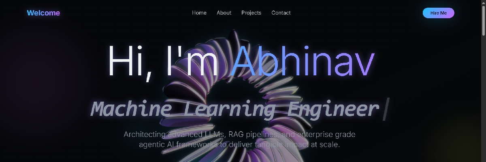

# 🌐 Abhinav Konjeti - Portfolio Website

<p align="center">
  
</p>


✨ Welcome to my **personal developer portfolio**, designed to showcase my journey, skills, and projects in **Generative AI** & **Agentic AI**.  
The site is live at **[abhinavkonjeti.vercel.app](https://abhinavkonjeti.vercel.app)** 🚀  

---

## ⚡ Highlights
- 🖥️ **Responsive UI** → Clean design, mobile-friendly  
- 📑 **Resume Integration** → Download & view my resume directly  
- 💡 **Projects Showcase** → Data Engineering & AI projects  
- 🌍 **Global Hosting** → Powered by Vercel for speed and reliability  

---

## 📂 Project Structure
```bash
.
├── public/                # Static files (resume.pdf, images, icons, banner.png)
├── src/
│   ├── components/        # UI Components (Navbar, Footer, Cards, etc.)
│   ├── pages/             # Pages (Home, About, Projects, Resume, Contact)
│   ├── styles/            # Styling (Tailwind + custom styles)
│   └── utils/             # Utility/helper functions
├── package.json           # Dependencies & scripts
├── tailwind.config.js     # Tailwind configuration
├── tsconfig.json          # TypeScript configuration
└── README.md              # Documentation (this file)


Hello Folks! I'm Abhinav sai Konjeti.
This project conatins my portfolio website along with a sleek and stylish spline addition.
This repo is deployed on vercel

portfolio live at abhinavkonjeti.vercel.app


You may feel free to clone and edit my repository!
Please star the repository
Any credits given is appreciated!
Have a good day, Happy Coding! :)
